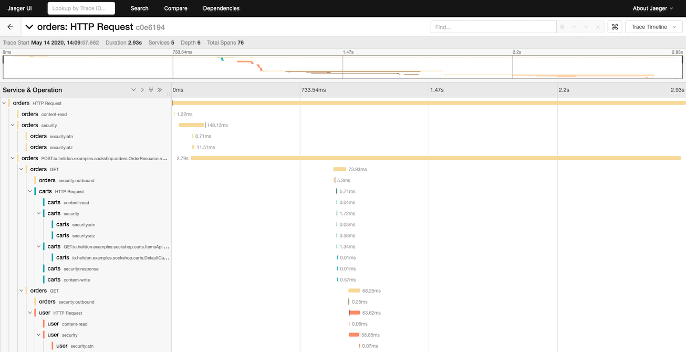
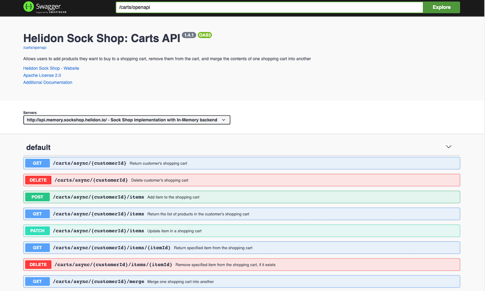

## Complete Application Deployment

* [Additional Pre-Requisites](#additional-pre-requisites)
* [Install Prometheus and Grafana](#install-prometheus-and-grafana)
* [Expose Application via a Load Balancer](#expose-application-via-a-load-balancer)
* [Install the Jaeger Operator](#install-the-jaeger-operator)
* [Access Swagger](#access-swagger)
* [Cleanup](#cleanup)

The Quick Start shows how you can run the application locally, but that may not
be enough if you want to experiment by scaling individual services, look at tracing data in Jaeger,
monitor services via Prometheus and Grafana, or make API calls directly via Swagger UI.

To do all of the above, you need to deploy the services into a managed Kubernetes cluster
in the cloud, by following the same set of steps described above (except for port forwarding,
which is not necessary), and performing a few additional steps.

### Additional Pre-Requisites

1. Install `envsubst`

   You must download and install `envsubst` for your platform from
   [https://github.com/a8m/envsubst](https://github.com/a8m/envsubst) and make it
   available in your `PATH`.

### Install Prometheus and Grafana

The following will install [Prometheus Operator](https://github.com/coreos/prometheus-operator/) into the
`monitoring` namespace using `helm`.

1. Create the `monitoring` namespace

   If you wish to install Prometheus or Jaegar Operator you must create the `monitoring` namespace using the following:

    ```bash
    $ kubectl create namespace monitoring
    ```

1. Create Prometheus pre-requisites

    ```bash
    $ kubectl apply -f k8s/optional/prometheus-rbac.yaml
    ```

1. Create Config Maps

    ```bash
    $ kubectl --namespace monitoring create configmap sockshop-grafana-dashboards --from-file=k8s/optional/grafana-dashboards/

    $ kubectl --namespace monitoring label configmap sockshop-grafana-dashboards grafana_dashboard=1

    $ kubectl --namespace monitoring create -f k8s/optional/grafana-datasource-config.yaml

    $ kubectl --namespace monitoring label configmap sockshop-grafana-datasource grafana_datasource=1

    $ kubectl --namespace monitoring create -f https://oracle.github.io/coherence-operator/dashboards/3.1.5/coherence-grafana-micrometer-dashboards.yaml

    $ kubectl --namespace monitoring label configmap coherence-grafana-dashboards grafana_dashboard=1
    ```

1. Install Prometheus Operator

   > Note: If you have already installed Prometheus Operator before on this Kuberenetes Cluster
   > then set `--set prometheusOperator.createCustomResource=false`.

    ```bash
    $ helm install --namespace monitoring --version 8.13.9 \
        --set grafana.enabled=true \
        --set prometheusOperator.createCustomResource=true \
        --set grafana.adminPassword=<SET_YOUR_ADMIN_PASSWORD> \
        --values k8s/optional/prometheus-values.yaml prometheus stable/prometheus-operator
    ```

   For helm version 2 use the following:

    ```bash
    $ helm install --namespace monitoring --version 8.13.9 \
        --set grafana.enabled=true --name prometheus \
        --set prometheusOperator.createCustomResource=true \
        --set grafana.adminPassword=<SET_YOUR_ADMIN_PASSWORD> \
        --values k8s/optional/prometheus-values.yaml stable/prometheus-operator
    ```

   **IMPORTANT**

   If you installed the back-end before you installed Prometheus Operator, you must
   run the following to delete and re-add the deployments for Prometheus to pickup the Pods.

   ```bash
   $ kubectl delete -k k8s/coherence --namespace sockshop

   $ kubectl apply -k k8s/coherence --namespace sockshop
   ```

### Expose Application via a Load Balancer

> Note: This is assuming you have deployed the back-ends via the instructions in
> the previous section.

1. Create the Load Balancer

    ```bash
    $ kubectl apply -f k8s/optional/ingress-controller.yaml

    $ kubectl get services --namespace ingress-nginx
    NAME            TYPE           CLUSTER-IP       EXTERNAL-IP       PORT(S)                      AGE
    ingress-nginx   LoadBalancer   AAA.BBB.CCC.DDD   WWW.XXX.YYY.ZZZ  80:31475/TCP,443:30578/TCP   17s
    ```

   Once you have been assigned an external IP address, continue to the next step.

1. Setup Domains

   You must have access to a top level domain for which you can create sub-domains to
   allow access to the application via a Load Balancer (LB).

   For example if your top level domain is `mycompany.com` then you
   should create a single wildcard DNS entry `*.sockshop.mycompany.com` to
   point to your external load balancer IP address.

1. Create the ingress

   In your terminal, export (or SET for Windows) your top level domain
   and the backend you are using.

   For example for domain `sockshop.mycompany.com` use the following

    ```bash
    $ export SOCKSHOP_DOMAIN=sockshop.mycompany.com

    $ envsubst -i k8s/optional/ingress.yaml | kubectl apply --namespace sockshop -f -

    $ kubectl get ingress --namespace sockshop

    NAME               HOSTS                                                                                                           ADDRESS           PORTS   AGE
    mp-ingress         mp.coherence.sockshop.mycompany.com                                                                             XXX.XXX.XXX.XXX   80      12d
    sockshop-ingress   coherence.sockshop.mycompany.com,jaeger.coherence.sockshop.mycompany.com,api.coherence.sockshop.mycompany.com   XXX.XXX.XXX.XXX   80      12d
    ```
1. Create the ingress for Grafana and Prometheus

   Ensuring you have the `SOCKSHOP_DOMAIN` environment variable set and issue the following:

    ```bash
    $ envsubst -i k8s/optional/ingress-grafana.yaml | kubectl apply --namespace monitoring -f -

    $ kubectl get ingress --namespace monitoring

    NAME              HOSTS                                                             ADDRESS          PORTS   AGE
    grafana-ingress   grafana.sockshop.mycompany.com,prometheus.sockshop.mycompany.com  XXX.YYY.XXX.YYY  80      12s
    ```

   The following URLs can be used to access Grafana and Prometheus. Please use the `admin` user password that was setup
   in the section `Install Prometheus Operator` above when using the URLs below:
    * http://grafana.sockshop.mycompany.com/
    * http://prometheus.sockshop.mycompany.com/

1. Access the application

   Access the application via the endpoint http://coherence.sockshop.mycompany.com/

### Install the Jaeger Operator

1. Install the Jaeger Operator

   The command below will create `monitoring` namespace and install Jaeger Operator into it.
   You only need to do this once, regardless of the number of backends you want to deploy.

    ```bash
    $ kubectl create -f k8s/optional/jaeger-operator.yaml
    ```

1. Deploy All-in-One Jaeger Instance

    ```bash
    $ kubectl create -f k8s/optional/jaeger.yaml --namespace sockshop
    ```

1. Enable Jaeger tracing in `application.yaml` files and rebuild and redeploy services
    ```
   tracing:
      jaeger:
         enabled: false
   ```

1. Exercise the Application and access Jaeger

   Acessing the Jaeger UI at http://jaeger.coherence.sockshop.mycompany.com/,
   you should see the trace information similar to the images below, allowing you
   to see how long each individual operation in the call tree took.

   

   

### Access Swagger

1. Deploy Swagger UI

    ```bash
    $ kubectl create -f k8s/optional/swagger.yaml --namespace sockshop
    ```

   Access the Swagger UI at http://mp.coherence.sockshop.mycompany.com/swagger/.

   Enter /carts/swagger/carts-1.0.yml into the Explore field at the top of the screen and click on Explore button.
   You should see the screen similar to the following, showing you all the endpoints for the Carts
   service (and their payloads), and allowing you to make API requests to it directly from your browser.

   

### Cleanup

1. Cleanup the ingress for applications

   To cleanup the ingress for your deployment, execute the following:

    ```bash
    $ export SOCKSHOP_DOMAIN=sockshop.mycompany.com

    $ envsubst -i k8s/optional/ingress.yaml| kubectl delete -f - --namespace sockshop
    ```

1. Cleanup the ingress for Grafana and Prometheus

   If you installed Prometheus Operator, execute the following:

    ```bash
    $ envsubst -i k8s/optional/ingress-grafana.yaml | kubectl delete --namespace monitoring -f -
    ```

1. Remove the deployed services

   To cleanup the deployed services, execute the following:

    ```bash
    $ export SOCKSHOP_DOMAIN=sockshop.mycompany.com
    $ kubectl delete -k k8s/coherence --namespace sockshop
    ```

1. Remove the Load Balancer

   If you wish to remove your load balancer, execute the following:

    ```bash
    $ kubectl delete -f k8s/optional/ingress-controller.yaml
    ```

1. Remove Jaeger

    ```bash
    $ kubectl delete -f k8s/optional/jaeger-operator.yaml
    ```

   Execute the following:

    ```bash
    $ kubectl delete -f k8s/optional/jaeger.yaml --namespace sockshop
    ```

1. Remove Swagger

   Execute the following:

    ```bash
   $ kubectl delete -f k8s/optional/swagger.yaml --namespace sockshop
    ```

1. Remove Prometheus and Grafana

   To cleanup the service monitors, execute the following commands:

    ```bash
    $ envsubst -i k8s/optional/prometheus-service-monitor.yaml | kubectl delete --namespace monitoring -f -
    ```

   To remove the Prometheus Operator, execute the following:

    ```bash
    $ helm delete prometheus --namespace monitoring

    $ kubectl --namespace monitoring delete configmap sockshop-grafana-dashboards

    $ kubectl --namespace monitoring delete configmap coherence-grafana-dashboards

    $ kubectl --namespace monitoring delete configmap sockshop-grafana-datasource

    $ kubectl --namespace monitoring delete -f k8s/optional/grafana-datasource-config.yaml

    $ kubectl delete -f k8s/optional/prometheus-rbac.yaml
    ```

   For helm version 2 use the following:

    ```bash
    $ helm delete prometheus --purge
    ```

   > Note: You can optionally delete the Prometheus Operator Custom Resource Definitions
   > (CRD's) if you are not going to install Prometheus Operator again.

   ```bash
   $ kubectl delete crd alertmanagers.monitoring.coreos.com
   $ kubectl delete crd podmonitors.monitoring.coreos.com
   $ kubectl delete crd prometheuses.monitoring.coreos.com
   $ kubectl delete crd prometheusrules.monitoring.coreos.com
   $ kubectl delete crd prometheusrules.monitoring.coreos.com
   $ kubectl delete crd servicemonitors.monitoring.coreos.com
   $ kubectl delete crd thanosrulers.monitoring.coreos.com
   ```

   A shorthand way of doing this if you are running Linux/Mac is:
   ```bash
   $ kubectl get crds --namespace monitoring | grep monitoring.coreos.com | awk '{print $1}' | xargs kubectl delete crd
   ```

1. Remove the Coherence Operator

    ```bash
    $ helm delete coherence-operator --namespace sockshop
    ```

   For helm version 2 use the following:

    ```bash
    $ helm delete coherence-operator --purge
    ```
